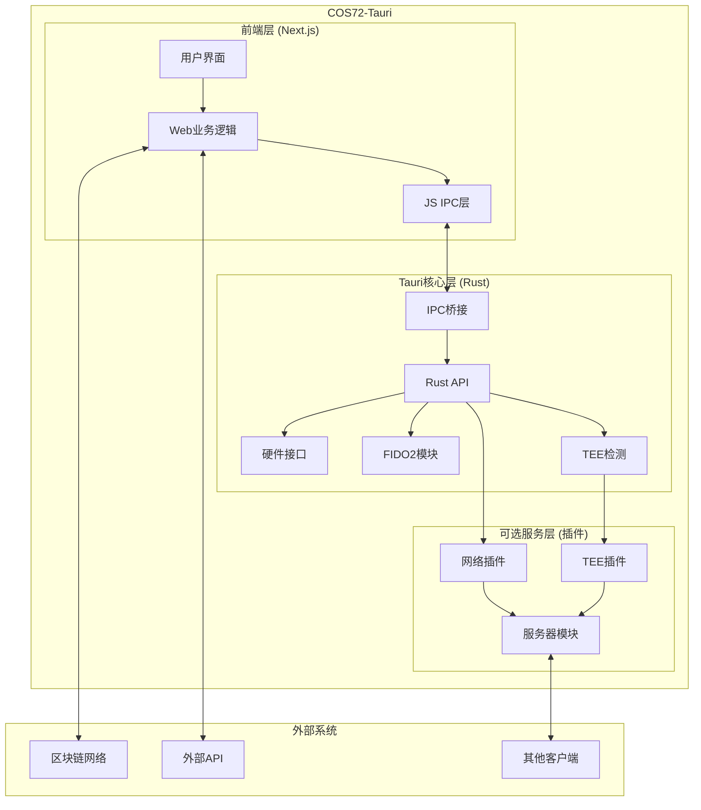
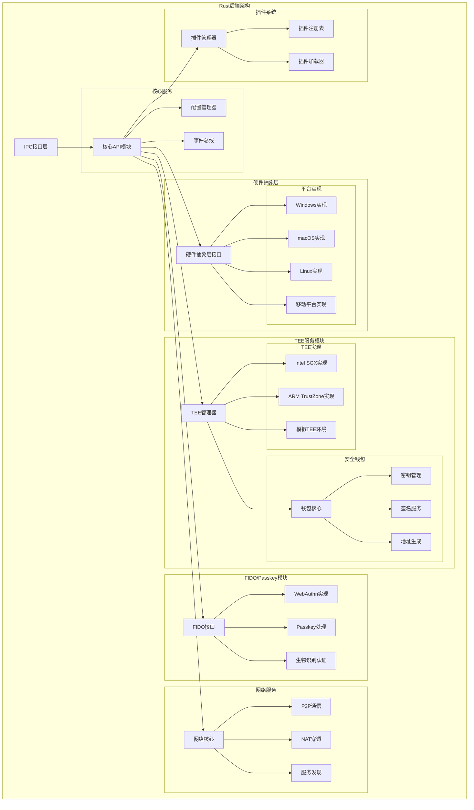
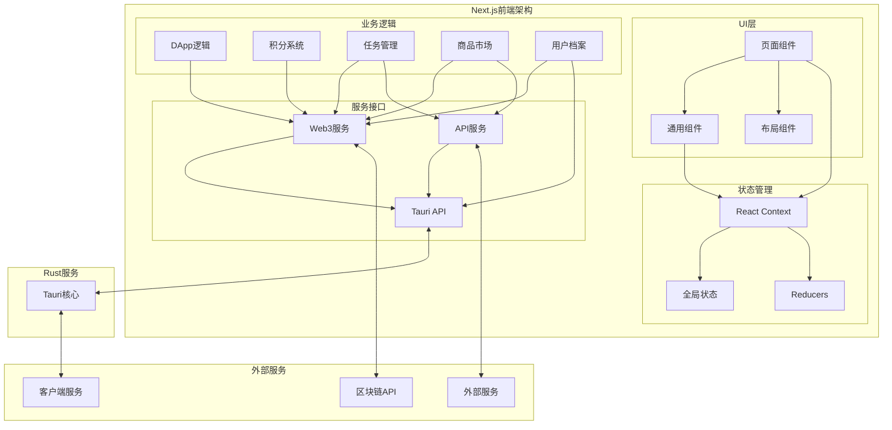
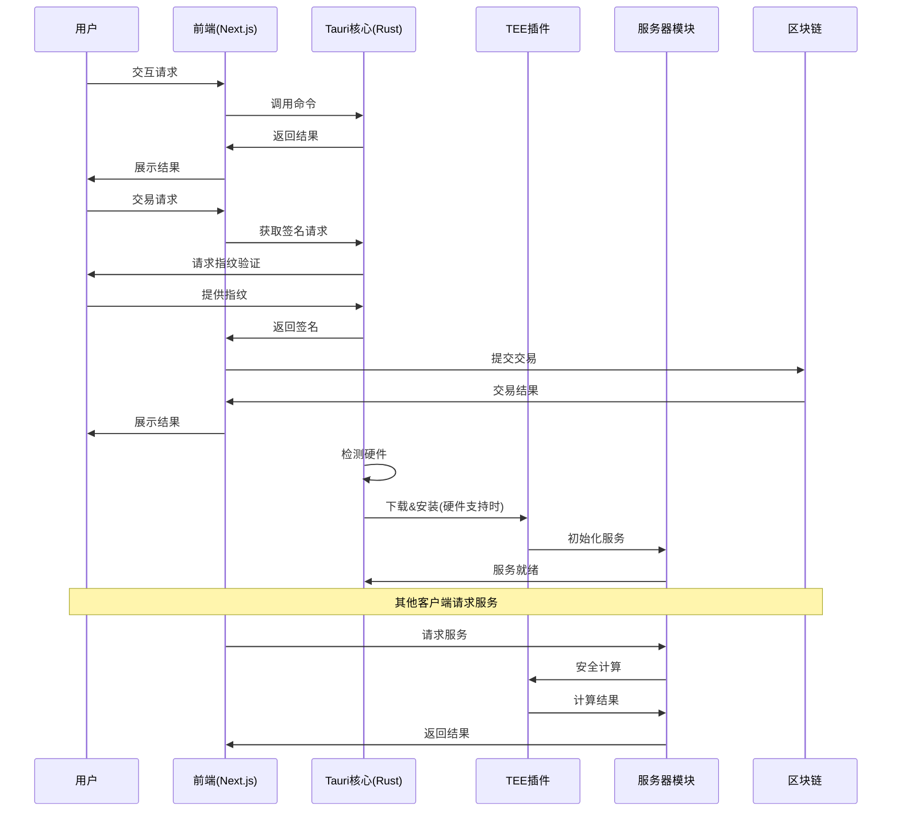

# COS72-Tauri 解决方案文档

## 1. 项目概述

COS72（Community Operation System
72）是一个基于Tauri框架的跨平台应用，具有双重角色：

1. **客户端角色**：为用户提供Web3身份、钱包、社区任务和积分管理等服务
2. **服务器角色**（可选）：在硬件支持的情况下，可升级为P2P存储技术服务提供方、TEE安全服务节点等，为其他客户端提供加密计算和数据隐私保护

本解决方案文档详细描述了COS72的技术架构、实现路径和风险分析。

## 2. 需求分析

### 2.1 核心功能需求

1. **基础客户端功能**
   - Web3账户创建与管理
   - 链上合约交互（免gas转账、积分系统）
   - 任务发布与接收
   - 积分商城
   - 基于FIDO2的生物识别签名（指纹/面容）

2. **TEE安全服务（可选）**
   - 硬件兼容性检测（支持SGX/TrustZone）
   - 服务插件下载与校验
   - 私钥安全管理
   - 交易签名验证
   - 对外提供Web3钱包服务

3. **网络服务功能**
   - 内网穿透/IP隧道
   - 服务发现与注册
   - API服务暴露

4. **定制化与配置**
   - 社区品牌定制（Logo、名称）
   - 合约地址与服务器列表配置
   - 基于链上合约的配置自动更新

### 2.2 技术与平台需求

1. **跨平台支持**
   - 桌面：Windows、macOS、Linux
   - 移动：Android、iOS

2. **技术集成**
   - 前端：Next.js/Node.js
   - 后端：Tauri/Rust
   - TEE：Teaclave SGX/TrustZone SDK
   - 生物识别：各平台FIDO2实现
   - 网络：内网穿透解决方案

## 3. 架构设计

### 3.1 系统整体架构图

### 3.2 Rust后端详细架构

### 3.3 前端架构与Rust服务交互图

### 3.4 数据流程图

## 4. 技术实现路径

### 4.1 前端实现

1. **技术选型**
   - Framework: Next.js (最新版)
   - UI库: Tailwind CSS + shadcn/ui
   - 状态管理: React Context/Redux
   - Web3交互: ethers.js 6.0+

2. **主要模块**
   - 用户认证界面
   - 钱包管理
   - 任务管理
   - 积分系统
   - 积分商城
   - 设置与配置

3. **应用场景实现**
   - 积分记录与管理
   - 商品上架与购买流程
   - 任务提交与审核
   - 加密附件下载与验证
   - 用户档案与成就系统

### 4.2 Tauri/Rust实现

1. **核心模块**
   - 系统接口层: 处理OS交互
   - FIDO2实现: 各平台生物识别适配
   - 硬件检测: CPU架构、TEE支持检测
   - 插件管理: 下载、校验与加载

2. **硬件抽象层设计**
   - 接口定义：提供统一的硬件访问接口
   - 平台实现：针对不同系统的具体实现
   - 硬件检测：提供硬件特性和能力检测
   - 设备管理：管理连接的外部设备

3. **FIDO2实现方案**
   - Windows: Windows Hello API
   - macOS: Touch ID API
   - Android: Biometric API
   - iOS: Face ID/Touch ID
   - Linux: 通过libfido2兼容库

### 4.3 TEE服务实现

1. **TEE支持检测**
   - Intel SGX检测
   - ARM TrustZone检测
   - 环境适应性测试

2. **TEE抽象层设计**
   - 通用TEE接口定义
   - SGX实现
   - TrustZone实现
   - 模拟TEE实现（开发与测试用）

3. **安全钱包服务**
   - 钱包密钥管理
   - 多种签名格式支持
   - 地址生成算法
   - 交易验证流程

4. **服务功能**
   - 钱包密钥管理
   - 交易签名
   - 数据加密/解密
   - 远程证明

### 4.4 网络服务实现

1. **内网穿透方案**
   - 使用ngrok/frp等库的Rust绑定
   - 自建中继服务器
   - P2P直连（WebRTC/UDP打洞）

2. **服务发现机制**
   - 本地网络服务发现
   - 公共节点注册
   - DHT分布式服务发现

3. **服务API设计**
   - RESTful API设计
   - WebSocket实时通信
   - 认证与授权机制

### 4.5 集成与部署

1. **应用打包**
   - 使用Tauri官方构建工具
   - 各平台特定设置
   - 自动更新配置

2. **插件分发**
   - 插件签名验证
   - 增量更新
   - 版本管理

## 5. 未来扩展计划

### 5.1 Rust后端扩展

1. **TEE服务扩展**
   - 支持更多TEE技术（AMD SEV, Apple Secure Enclave）
   - 安全多方计算(MPC)集成
   - 零知识证明(ZKP)计算支持

2. **硬件支持扩展**
   - 硬件钱包集成（Ledger, Trezor等）
   - 专用加密硬件支持
   - IoT设备支持

3. **安全钱包增强**
   - 多链支持（BTC, ETH, Solana等）
   - 智能合约交互增强
   - 账户抽象支持

4. **网络服务增强**
   - 分布式存储集成
   - 强化P2P网络能力
   - 网络隐私保护（Tor, I2P）

### 5.2 前端应用扩展

1. **应用生态扩展**
   - 插件市场
   - 社区治理工具
   - DeFi功能集成
   - NFT功能支持

2. **UI/UX增强**
   - 多语言支持
   - 自定义主题
   - 辅助功能增强
   - 移动端优化

3. **业务场景扩展**
   - 社交功能
   - 加密内容创作与分享
   - 去中心化身份应用
   - 数据市场功能

## 6. 风险分析与对策

### 6.1 技术风险

1. **跨平台兼容性**
   - 风险: 各平台生物识别实现差异大
   - 对策: 采用模块化设计，针对不同平台提供不同实现

2. **TEE环境依赖**
   - 风险: 用户环境可能缺少必要驱动或支持
   - 对策: 提供降级方案，明确提示用户安装必要组件

3. **网络穿透稳定性**
   - 风险: 家庭网络环境复杂，穿透成功率不稳定
   - 对策: 多种穿透方案结合，失败时自动切换

### 6.2 安全风险

1. **密钥管理安全**
   - 风险: 密钥泄露可导致资产损失
   - 对策: 严格隔离密钥存储，采用多重加密与分片技术

2. **TEE漏洞**
   - 风险: TEE技术本身可能存在漏洞
   - 对策: 定期更新TEE环境，采用多层防护

3. **前端注入攻击**
   - 风险: 前端JavaScript可能被注入恶意代码
   - 对策: 关键操作在Rust层执行，前端输入严格验证

### 6.3 业务风险

1. **用户体验与复杂性**
   - 风险: 复杂功能影响用户体验
   - 对策: 渐进式功能展示，简化UI流程

2. **合规性问题**
   - 风险: 不同地区法规要求不同
   - 对策: 模块化设计，根据地区动态加载功能

3. **社区激励可持续性**
   - 风险: 初期激励不足，用户参与度低
   - 对策: 多层次激励机制，阶梯式释放奖励

## 7. 开发计划与里程碑

### 7.1 v0.1 版本

- 基础Web UI搭建
- Tauri框架集成
- FIDO2基础功能
- CPU检测功能
- TEE插件下载框架

### 7.2 v0.2 版本

- 完整账户管理
- 交易签名流程
- TEE插件基础功能

### 7.3 v0.3 版本

- 网络穿透功能
- 服务器模式基础功能
- 配置管理

### 7.4 v1.0 版本

- 完整业务功能
- 全平台兼容性优化
- 安全审计与修复
- 性能优化

## 8. 结论

COS72-Tauri项目技术上完全可行，Tauri框架结合Rust的能力，能够满足跨平台客户端和可选服务器的双重角色需求。关键挑战在于TEE环境的适配和网络穿透的稳定性，但通过合理的架构设计和降级策略，可以保证核心功能的可用性。

该解决方案提供了完整的技术路径，从前端到后端，从基础客户端到TEE安全服务，形成了一个完整的技术体系。建议按照逐步迭代的方式进行开发，优先实现核心功能，再逐步扩展高级特性。
