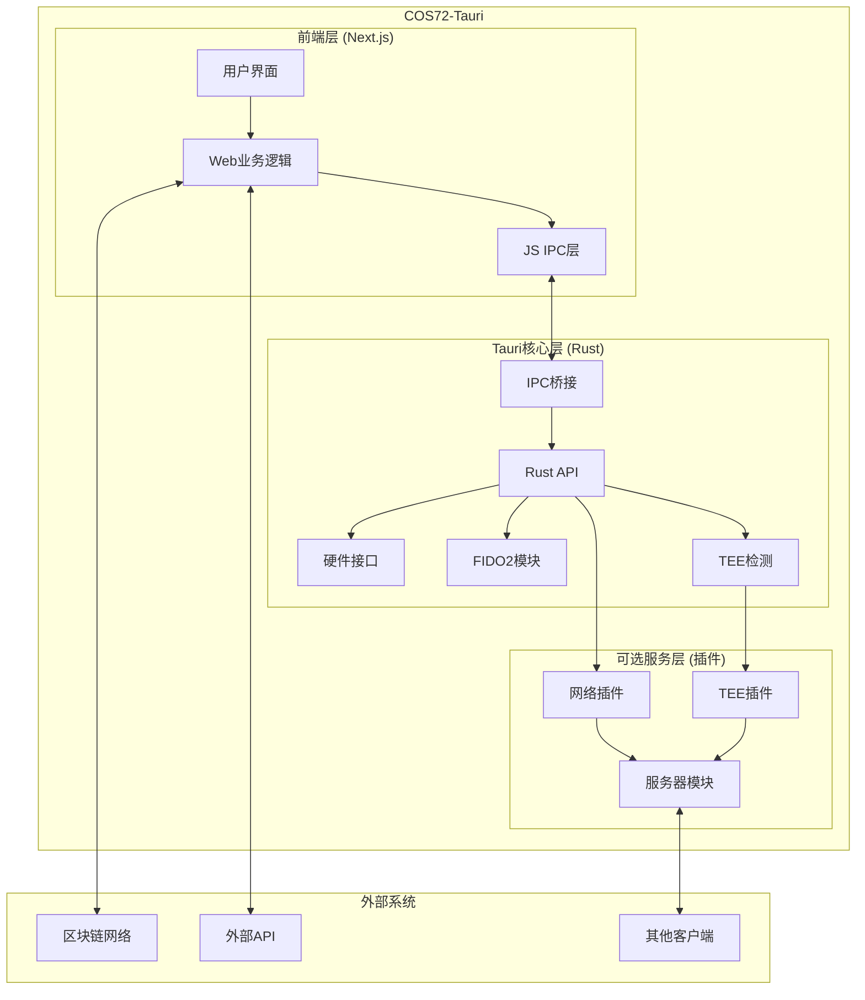
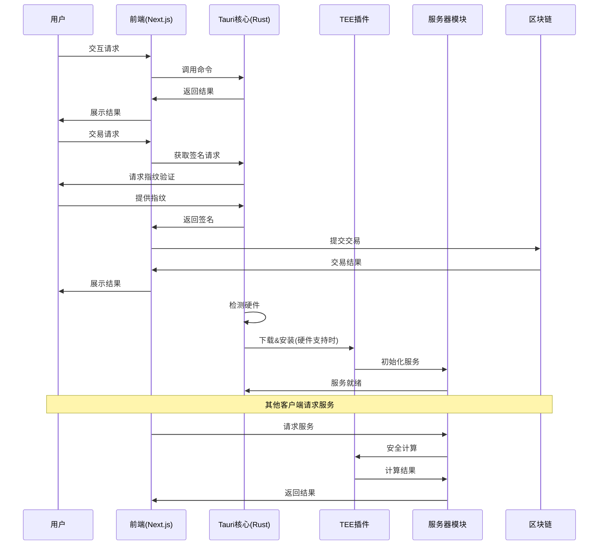

# COS72-Tauri 解决方案文档

## 1. 项目概述

COS72（Community Operation System 72）是一个基于Tauri框架的跨平台应用，具有双重角色：
1. **客户端角色**：为用户提供Web3身份、钱包、社区任务和积分管理等服务
2. **服务器角色**（可选）：在硬件支持的情况下，可升级为TEE安全服务节点，为其他客户端提供加密计算和数据隐私保护

本解决方案文档详细描述了COS72的技术架构、实现路径和风险分析。

## 2. 需求分析

### 2.1 核心功能需求

1. **基础客户端功能**
   - Web3账户创建与管理
   - 链上合约交互（免gas转账、积分系统）
   - 任务发布与接收
   - 积分商城
   - 基于FIDO2的生物识别签名（指纹/面容）
   
2. **TEE安全服务（可选）**
   - 硬件兼容性检测（支持SGX/TrustZone）
   - 服务插件下载与校验
   - 私钥安全管理
   - 交易签名验证
   - 对外提供Web3钱包服务
   
3. **网络服务功能**
   - 内网穿透/IP隧道
   - 服务发现与注册
   - API服务暴露
   
4. **定制化与配置**
   - 社区品牌定制（Logo、名称）
   - 合约地址与服务器列表配置
   - 基于链上合约的配置自动更新

### 2.2 技术与平台需求

1. **跨平台支持**
   - 桌面：Windows、macOS、Linux
   - 移动：Android、iOS
   
2. **技术集成**
   - 前端：Next.js/Node.js
   - 后端：Tauri/Rust
   - TEE：Teaclave SGX/TrustZone SDK
   - 生物识别：各平台FIDO2实现
   - 网络：内网穿透解决方案

## 3. 架构设计

### 3.1 系统架构图

### 3.2 组件说明

1. **前端层**
   - **用户界面**：提供交互和展示
   - **Web业务逻辑**：处理应用核心功能
   - **JS IPC层**：与Rust层通信

2. **Tauri核心层**
   - **Rust API**：提供核心功能和接口
   - **IPC桥接**：连接前端和Rust逻辑
   - **硬件接口**：访问系统硬件
   - **FIDO2模块**：处理生物识别和安全签名
   - **TEE检测**：检查TEE支持情况

3. **可选服务层**
   - **TEE插件**：安全计算环境
   - **网络插件**：内网穿透功能
   - **服务器模块**：对外提供服务的API

### 3.3 数据流程图

## 4. 技术实现路径

### 4.1 前端实现

1. **技术选型**
   - Framework: Next.js
   - UI库: Tailwind CSS + React组件
   - 状态管理: React Context/Redux
   - Web3交互: ethers.js/web3.js

2. **主要模块**
   - 用户认证界面
   - 钱包管理
   - 任务管理
   - 积分系统
   - 设置与配置

### 4.2 Tauri/Rust实现

1. **核心模块**
   - 系统接口层: 处理OS交互
   - FIDO2实现: 各平台生物识别适配
   - 硬件检测: CPU架构、TEE支持检测
   - 插件管理: 下载、校验与加载

2. **FIDO2实现方案**
   - Windows: Windows Hello API
   - macOS: Touch ID API
   - Android: Biometric API
   - iOS: Face ID/Touch ID
   - Linux: 通过libfido2兼容库

### 4.3 TEE服务实现

1. **TEE支持检测**
   - Intel SGX检测
   - ARM TrustZone检测

2. **TEE插件实现**
   - 基于Teaclave SGX SDK
   - 插件生命周期管理
   - 安全通信接口

3. **服务功能**
   - 钱包密钥管理
   - 交易签名
   - 数据加密/解密

### 4.4 网络服务实现

1. **内网穿透方案**
   - 使用ngrok/frp等库的Rust绑定
   - 自建中继服务器
   - P2P直连（WebRTC/UDP打洞）

2. **服务API设计**
   - RESTful API设计
   - WebSocket实时通信
   - 认证与授权机制

### 4.5 集成与部署

1. **应用打包**
   - 使用Tauri官方构建工具
   - 各平台特定设置
   - 自动更新配置

2. **插件分发**
   - 插件签名验证
   - 增量更新
   - 版本管理

## 5. 风险分析与对策

### 5.1 技术风险

1. **跨平台兼容性**
   - 风险: 各平台生物识别实现差异大
   - 对策: 采用模块化设计，针对不同平台提供不同实现

2. **TEE环境依赖**
   - 风险: 用户环境可能缺少必要驱动或支持
   - 对策: 提供降级方案，明确提示用户安装必要组件

3. **网络穿透稳定性**
   - 风险: 家庭网络环境复杂，穿透成功率不稳定
   - 对策: 多种穿透方案结合，失败时自动切换

### 5.2 安全风险

1. **插件安全性**
   - 风险: 恶意插件或篡改风险
   - 对策: 代码签名、哈希校验、安全下载通道

2. **密钥管理**
   - 风险: 私钥泄露
   - 对策: 使用TEE存储密钥，非TEE环境加强本地加密

3. **未授权访问**
   - 风险: 服务器功能被未授权访问
   - 对策: 强认证机制、访问控制、审计日志

### 5.3 用户体验风险

1. **复杂度**
   - 风险: 功能过于复杂导致用户使用困难
   - 对策: 简化界面，提供向导，渐进式功能展示

2. **性能问题**
   - 风险: TEE操作可能导致性能下降
   - 对策: 异步处理，显示进度指示，优化关键路径

## 6. 开发计划与里程碑

### 6.1 v0.1 版本
- 基础Web UI搭建
- Tauri框架集成
- FIDO2基础功能
- CPU检测功能
- TEE插件下载框架

### 6.2 v0.2 版本
- 完整账户管理
- 交易签名流程
- TEE插件基础功能

### 6.3 v0.3 版本
- 网络穿透功能
- 服务器模式基础功能
- 配置管理

### 6.4 v1.0 版本
- 完整业务功能
- 全平台兼容性优化
- 安全审计与修复
- 性能优化

## 7. 结论

COS72-Tauri项目技术上完全可行，Tauri框架结合Rust的能力，能够满足跨平台客户端和可选服务器的双重角色需求。关键挑战在于TEE环境的适配和网络穿透的稳定性，但通过合理的架构设计和降级策略，可以保证核心功能的可用性。

该解决方案提供了完整的技术路径，从前端到后端，从基础客户端到TEE安全服务，形成了一个完整的技术体系。建议按照逐步迭代的方式进行开发，优先实现核心功能，再逐步扩展高级特性。 